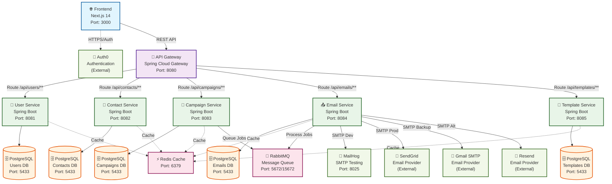

# Sistema de Correos Masivos - Documentación Completa

## 📋 Tabla de Contenidos

1. [Descripción General](#descripción-general)
2. [Arquitectura del Sistema](#arquitectura-del-sistema)
3. [Requisitos Previos](#requisitos-previos)
4. [Instalación y Configuración](#instalación-y-configuración)
5. [Microservicios](#microservicios)
6. [Frontend - Admin Platform](#frontend---admin-platform)
7. [Base de Datos](#base-de-datos)
8. [Infraestructura](#infraestructura)
9. [APIs y Endpoints](#apis-y-endpoints)
10. [Testing](#testing)
11. [Despliegue](#despliegue)
12. [Monitoreo y Logs](#monitoreo-y-logs)
13. [Troubleshooting](#troubleshooting)

---

## 🎯 Descripción General

Sistema de envío de correos masivos desarrollado con arquitectura de microservicios usando Spring Boot y Next.js. Permite gestionar contactos, crear campañas de email marketing, administrar plantillas y realizar seguimiento de estadísticas de envío.

### Características Principales

- **Arquitectura de Microservicios**: Servicios independientes y escalables
- **Frontend Moderno**: Next.js 14 con TypeScript y Tailwind CSS
- **Autenticación Segura**: Integración con Auth0
- **Múltiples Proveedores SMTP**: SendGrid, Gmail, Resend, MailHog
- **Gestión de Colas**: RabbitMQ para procesamiento asíncrono
- **Cache Distribuido**: Redis para optimización de rendimiento
- **Base de Datos Robusta**: PostgreSQL con migraciones Flyway
- **Monitoreo Completo**: Logs centralizados y métricas

---

## 🏗️ Arquitectura del Sistema



### Puertos por Defecto

| Servicio | Puerto | Descripción |
|----------|--------|-------------|
| Frontend | 3000 | Aplicación Next.js |
| API Gateway | 8080 | Punto de entrada principal |
| User Service | 8081 | Gestión de usuarios |
| Contact Service | 8082 | Gestión de contactos |
| Campaign Service | 8083 | Gestión de campañas |
| Email Service | 8084 | Envío de correos |
| Template Service | 8085 | Gestión de plantillas |
| PostgreSQL | 5433 | Base de datos |
| Redis | 6379 | Cache |
| RabbitMQ | 5672/15672 | Cola de mensajes |
| MailHog | 1025/8025 | SMTP de desarrollo |

---

## 📋 Requisitos Previos

### Software Requerido

- **Java 11+** - Para microservicios Spring Boot
- **Node.js 18+** - Para el frontend Next.js
- **Maven 3.6+** - Para construcción de proyectos Java
- **Docker & Docker Compose** - Para infraestructura
- **Git** - Para control de versiones

### Verificación de Requisitos

```bash
# Verificar Java
java -version

# Verificar Node.js
node --version
npm --version

# Verificar Maven
mvn --version

# Verificar Docker
docker --version
docker-compose --version
```

---

## 🚀 Instalación y Configuración

### 1. Clonar el Repositorio

```bash
git clone <repository-url>
cd bundle-correos-masivos
```

### 2. Configuración de Variables de Entorno

Copiar y configurar el archivo de variables de entorno:

```bash
copy .env.example .env
```

**Variables principales en `.env`:**

```env
# Puertos de Microservicios
API_GATEWAY_PORT=8080
USER_SERVICE_PORT=8081
CONTACT_SERVICE_PORT=8082
CAMPAIGN_SERVICE_PORT=8083
EMAIL_SERVICE_PORT=8084
TEMPLATE_SERVICE_PORT=8085

# Base de Datos PostgreSQL
DB_HOST=correos-postgres
DB_PORT=5432
DB_USERNAME=postgres
DB_PASSWORD=password

# Auth0 Configuration
AUTH0_DOMAIN=dev-1zvh0tbtrif4683g.us.auth0.com
AUTH0_ISSUER_URI=https://dev-1zvh0tbtrif4683g.us.auth0.com/
AUTH0_AUDIENCE=XtrimIdentityAPI
AUTH0_CLIENT_ID=your-client-id
AUTH0_CLIENT_SECRET=your-client-secret

# Email Providers
SENDGRID_API_KEY=your-sendgrid-api-key
GMAIL_USERNAME=your-email@gmail.com
GMAIL_PASSWORD=your-app-password
RESEND_API_KEY=your-resend-api-key
```

### 3. Iniciar Infraestructura

```bash
# Opción 1: Script automático
cd config
start-infrastructure.bat

# Opción 2: Docker Compose manual
cd config
docker-compose up -d
```

### 4. Compilar Microservicios

```bash
# Opción 1: Script automático
cd setup
build.bat

# Opción 2: Maven manual
mvn clean install -DskipTests
```

### 5. Iniciar Microservicios

```bash
# Opción 1: Script automático
cd setup
start-services.bat

# Opción 2: Manual (en terminales separadas)
cd apigateway/api-gateway && mvn spring-boot:run
cd microservicios/user-service && mvn spring-boot:run
cd microservicios/contact-service && mvn spring-boot:run
cd microservicios/campaign-service && mvn spring-boot:run
cd microservicios/email-service && mvn spring-boot:run
cd microservicios/template-service && mvn spring-boot:run
```

### 6. Iniciar Frontend

```bash
# Opción 1: Script automático
cd frontend
start-frontend.bat

# Opción 2: Manual
cd frontend/admin-platform
npm install --legacy-peer-deps
npm run dev
```

### 7. Verificar Instalación

Acceder a las siguientes URLs para verificar que todo funciona:

- **Frontend**: http://localhost:3000
- **API Gateway**: http://localhost:8080/actuator/health
- **PostgreSQL**: http://localhost:5433 (pgAdmin: http://localhost:5050)
- **RabbitMQ**: http://localhost:15672 (admin/password)
- **MailHog**: http://localhost:8025
- **Redis**: localhost:6379

---

## 🔧 Microservicios

### API Gateway (Puerto 8080)

**Responsabilidades:**
- Punto de entrada único para todas las peticiones
- Enrutamiento a microservicios
- Balanceador de carga
- Manejo de CORS

**Tecnologías:**
- Spring Cloud Gateway
- Spring Boot Actuator

**Endpoints principales:**
- `/api/users/**` → User Service
- `/api/contacts/**` → Contact Service
- `/api/campaigns/**` → Campaign Service
- `/api/emails/**` → Email Service
- `/api/templates/**` → Template Service

### User Service (Puerto 8081)

**Responsabilidades:**
- Gestión de usuarios del sistema
- Autenticación y autorización
- Perfiles de usuario
- Configuraciones personales

**Tecnologías:**
- Spring Boot 2.7.18
- Spring Security + OAuth2
- Spring Data JPA
- PostgreSQL
- Redis (cache)
- Flyway (migraciones)

**Base de datos:** `correos_masivos_users`

**Endpoints principales:**
```
GET    /api/users/profile          # Obtener perfil del usuario
PUT    /api/users/profile          # Actualizar perfil
GET    /api/users/settings         # Obtener configuraciones
PUT    /api/users/settings         # Actualizar configuraciones
POST   /api/users/change-password  # Cambiar contraseña
```

### Contact Service (Puerto 8082)

**Responsabilidades:**
- Gestión de contactos y listas
- Importación masiva (CSV/Excel)
- Segmentación de audiencias
- Gestión de suscripciones

**Tecnologías:**
- Spring Boot 2.7.18
- Spring Data JPA
- PostgreSQL
- Apache POI (Excel)
- OpenCSV

**Base de datos:** `correos_masivos_contacts`

**Funcionalidades principales:**
- CRUD de contactos
- Gestión de listas de contactos
- Importación CSV/Excel con preview
- Operaciones masivas (bulk)
- Filtros y búsqueda avanzada
- Estadísticas por lista

**Endpoints principales:**
```
# Contactos
POST   /api/contacts                    # Crear contacto
GET    /api/contacts                    # Listar contactos (con filtros)
GET    /api/contacts/{id}               # Obtener contacto
PUT    /api/contacts/{id}               # Actualizar contacto
DELETE /api/contacts/{id}               # Eliminar contacto

# Listas
POST   /api/contacts/lists              # Crear lista
GET    /api/contacts/lists              # Listar listas
GET    /api/contacts/list/{id}          # Obtener lista
PUT    /api/contacts/list/{id}          # Actualizar lista
DELETE /api/contacts/list/{id}          # Eliminar lista

# Importación
POST   /api/contacts/import/csv/preview # Preview CSV
POST   /api/contacts/import/csv         # Importar CSV
GET    /api/contacts/import             # Historial importaciones
```

### Campaign Service (Puerto 8083)

**Responsabilidades:**
- Gestión de campañas de email marketing
- Programación de envíos
- Segmentación de audiencias
- Estados y flujos de campaña

**Tecnologías:**
- Spring Boot 2.7.18
- Spring Data JPA
- PostgreSQL
- Spring Scheduler

**Base de datos:** `correos_masivos_campaigns`

**Estados de campaña:**
- `DRAFT` - Borrador
- `SCHEDULED` - Programada
- `SENDING` - Enviando
- `SENT` - Enviada
- `PAUSED` - Pausada
- `CANCELLED` - Cancelada
- `FAILED` - Fallida

**Endpoints principales:**
```
# Gestión de campañas
POST   /api/campaigns                   # Crear campaña
GET    /api/campaigns                   # Listar campañas
GET    /api/campaigns/{id}              # Obtener campaña
PUT    /api/campaigns/{id}              # Actualizar campaña
DELETE /api/campaigns/{id}              # Eliminar campaña

# Control de estado
POST   /api/campaigns/{id}/schedule     # Programar campaña
POST   /api/campaigns/{id}/start        # Iniciar campaña
POST   /api/campaigns/{id}/pause        # Pausar campaña
POST   /api/campaigns/{id}/cancel       # Cancelar campaña

# Destinatarios
POST   /api/campaigns/{id}/targets      # Agregar lista objetivo
GET    /api/campaigns/{id}/targets      # Obtener listas objetivo
```

### Email Service (Puerto 8084)

**Responsabilidades:**
- Envío de correos electrónicos
- Gestión de múltiples proveedores SMTP
- Tracking de eventos (aperturas, clics, rebotes)
- Reintentos automáticos
- Estadísticas de envío

**Tecnologías:**
- Spring Boot 2.7.18
- Spring Data JPA
- RabbitMQ (colas)
- PostgreSQL
- SendGrid SDK
- AWS SES SDK
- JavaMail

**Base de datos:** `correos_masivos_emails`

**Proveedores SMTP soportados (orden de prioridad):**
1. **SendGrid** (principal)
2. **Gmail SMTP** (backup principal)
3. **Microsoft 365** (backup secundario)
4. **Resend** (alternativo)
5. **MailHog** (desarrollo)

**Estados de email:**
- `PENDING` - Pendiente
- `SENDING` - Enviando
- `SENT` - Enviado
- `DELIVERED` - Entregado
- `OPENED` - Abierto
- `CLICKED` - Clic realizado
- `BOUNCED` - Rebotado
- `FAILED` - Fallido

**Endpoints principales:**
```
# Envío
POST   /api/emails/send                 # Enviar email individual
POST   /api/emails/send/bulk            # Envío masivo

# Logs y tracking
GET    /api/emails                      # Logs de emails
GET    /api/emails/{id}                 # Log específico
POST   /api/emails/campaigns/{id}/retry # Reintentar fallidos

# Webhooks
POST   /api/emails/webhooks/delivery    # Webhook entrega
POST   /api/emails/webhooks/open        # Webhook apertura
POST   /api/emails/webhooks/click       # Webhook clic

# Estadísticas
GET    /api/emails/stats                # Estadísticas básicas
GET    /api/emails/stats/detailed       # Estadísticas detalladas
GET    /api/emails/stats/realtime       # Tiempo real
```

### Template Service (Puerto 8085)

**Responsabilidades:**
- Gestión de plantillas de email
- Editor de plantillas HTML
- Variables dinámicas
- Renderizado de contenido
- Versionado de plantillas

**Tecnologías:**
- Spring Boot 2.7.18
- Spring Data JPA
- PostgreSQL
- Thymeleaf (renderizado)
- JSoup (parsing HTML)

**Base de datos:** `correos_masivos_templates`

**Tipos de plantilla:**
- `EMAIL` - Plantillas de correo
- `SMS` - Plantillas de SMS
- `PUSH_NOTIFICATION` - Notificaciones push

**Estados de plantilla:**
- `DRAFT` - Borrador
- `ACTIVE` - Activa
- `ARCHIVED` - Archivada

**Endpoints principales:**
```
# Gestión de plantillas
POST   /api/templates                   # Crear plantilla
GET    /api/templates                   # Listar plantillas
GET    /api/templates/{id}              # Obtener plantilla
PUT    /api/templates/{id}              # Actualizar plantilla
DELETE /api/templates/{id}              # Eliminar plantilla

# Estados
POST   /api/templates/{id}/activate     # Activar plantilla
POST   /api/templates/{id}/archive      # Archivar plantilla

# Renderizado
POST   /api/templates/{id}/render       # Renderizar completa
POST   /api/templates/{id}/preview      # Vista previa
GET    /api/templates/{id}/variables    # Obtener variables
```

### Shared Libraries

#### Shared Common
**Funcionalidades:**
- DTOs comunes
- Excepciones personalizadas
- Utilidades de validación
- Configuraciones base
- Constantes del sistema

#### Shared Queue
**Funcionalidades:**
- Configuración RabbitMQ
- Productores y consumidores
- Serialización de mensajes
- Manejo de errores en colas
- Dead letter queues

---

## 🎨 Frontend - Admin Platform

### Tecnologías

- **Next.js 14** - Framework React con App Router
- **TypeScript** - Tipado estático
- **Tailwind CSS** - Framework de estilos
- **Auth0** - Autenticación
- **Recharts** - Gráficos
- **Heroicons** - Iconografía

### Estructura del Proyecto

```
frontend/admin-platform/
├── src/
│   ├── app/                    # App Router Next.js
│   │   ├── api/auth/[auth0]/   # Rutas Auth0
│   │   ├── dashboard/          # Dashboard principal
│   │   ├── contacts/           # Gestión contactos
│   │   ├── campaigns/          # Gestión campañas
│   │   ├── templates/          # Gestión plantillas
│   │   ├── globals.css         # Estilos globales
│   │   ├── layout.tsx          # Layout principal
│   │   └── page.tsx            # Página inicio
│   ├── components/             # Componentes React
│   │   ├── Dashboard.tsx       # Dashboard principal
│   │   ├── Header.tsx          # Header navegación
│   │   ├── Sidebar.tsx         # Navegación lateral
│   │   ├── contacts/           # Componentes contactos
│   │   ├── campaigns/          # Componentes campañas
│   │   └── templates/          # Componentes plantillas
│   ├── lib/                    # Utilidades
│   │   ├── api.ts              # Cliente API
│   │   └── auth.ts             # Configuración Auth0
│   └── types/                  # Tipos TypeScript
├── public/                     # Archivos estáticos
├── .env.local                  # Variables entorno
├── next.config.js              # Configuración Next.js
├── tailwind.config.js          # Configuración Tailwind
└── package.json                # Dependencias
```

### Configuración Auth0

**Variables en `.env.local`:**

```env
AUTH0_SECRET='use [openssl rand -hex 32] to generate a 32 bytes value'
AUTH0_BASE_URL='http://localhost:3000'
AUTH0_ISSUER_BASE_URL='https://dev-1zvh0tbtrif4683g.us.auth0.com'
AUTH0_CLIENT_ID='your-auth0-client-id'
AUTH0_CLIENT_SECRET='your-auth0-client-secret'
NEXT_PUBLIC_API_URL='http://localhost:8080/api'
```

### Funcionalidades Implementadas

#### Dashboard Principal
- **Métricas en tiempo real**: Contactos, campañas, plantillas, emails
- **Gráficos interactivos**: Estadísticas de envío por mes
- **Actividad reciente**: Últimas acciones del sistema
- **Diseño responsive**: Adaptable a todos los dispositivos

#### Gestión de Contactos
- **CRUD completo**: Crear, editar, eliminar contactos
- **Importación masiva**: CSV/Excel con preview
- **Gestión de listas**: Organización por segmentos
- **Filtros avanzados**: Búsqueda por múltiples criterios
- **Operaciones masivas**: Acciones en lote

#### Gestión de Campañas
- **Creación de campañas**: Wizard paso a paso
- **Programación**: Envío inmediato o programado
- **Segmentación**: Selección de audiencias
- **Seguimiento**: Métricas en tiempo real
- **Estados**: Control completo del flujo

#### Gestión de Plantillas
- **Editor visual**: Creación de plantillas HTML
- **Variables dinámicas**: Personalización automática
- **Vista previa**: Renderizado en tiempo real
- **Biblioteca**: Gestión de plantillas reutilizables
- **Versionado**: Control de cambios

### Sistema de Diseño Xtrim

**Colores principales:**
- Primary: `#6F1EAB` (Púrpura)
- Secondary: `#9C27B0` (Púrpura claro)
- Tertiary: `#C2185B` (Rosa)
- Accent: `#FFD700` (Dorado)

**Componentes estilizados:**
- Botones con efectos hover
- Cards con efecto glass
- Gradientes personalizados
- Tipografía Inter

### Scripts Disponibles

```bash
npm run dev          # Servidor desarrollo
npm run build        # Construcción producción
npm run start        # Servidor producción
npm run lint         # Linting código
```

---

## 🗄️ Base de Datos

### PostgreSQL - Estructura

El sistema utiliza PostgreSQL con bases de datos separadas por microservicio:

#### Bases de Datos

| Base de Datos | Servicio | Descripción |
|---------------|----------|-------------|
| `correos_masivos_users` | User Service | Usuarios y configuraciones |
| `correos_masivos_contacts` | Contact Service | Contactos y listas |
| `correos_masivos_campaigns` | Campaign Service | Campañas y programación |
| `correos_masivos_emails` | Email Service | Logs de envío y tracking |
| `correos_masivos_templates` | Template Service | Plantillas y variables |

#### Migraciones Flyway

Cada microservicio gestiona sus propias migraciones:

```
src/main/resources/db/migration/
├── V1__Create_users_table.sql
├── V2__Create_user_settings_table.sql
├── V3__Add_user_indexes.sql
└── ...
```

#### Configuración de Conexión

```yaml
spring:
  datasource:
    url: jdbc:postgresql://localhost:5433/correos_masivos_users
    username: postgres
    password: password
    hikari:
      maximum-pool-size: 10
      minimum-idle: 2
```

### Redis - Cache

**Uso principal:**
- Cache de sesiones de usuario
- Cache de consultas frecuentes
- Rate limiting
- Datos temporales

**Configuración:**
```yaml
spring:
  data:
    redis:
      host: correos-redis
      port: 6379
      password: ""
```

---

## 🏗️ Infraestructura

### Docker Compose

La infraestructura se gestiona con Docker Compose:

```yaml
services:
  postgres:
    image: postgres:15-alpine
    ports: ["5433:5432"]
    environment:
      POSTGRES_USER: postgres
      POSTGRES_PASSWORD: password
    volumes:
      - postgres_data:/var/lib/postgresql/data
      - ./init-databases.sql:/docker-entrypoint-initdb.d/init-databases.sql

  redis:
    image: redis:7-alpine
    ports: ["6379:6379"]
    command: redis-server --appendonly yes

  rabbitmq:
    image: rabbitmq:3-management-alpine
    ports: ["5672:5672", "15672:15672"]
    environment:
      RABBITMQ_DEFAULT_USER: admin
      RABBITMQ_DEFAULT_PASS: password

  mailhog:
    image: mailhog/mailhog:latest
    ports: ["1025:1025", "8025:8025"]
```

### Servicios de Infraestructura

#### PostgreSQL
- **Puerto**: 5433
- **Usuario**: postgres
- **Contraseña**: password
- **Bases de datos**: Creadas automáticamente

#### Redis
- **Puerto**: 6379
- **Persistencia**: Habilitada con AOF

#### RabbitMQ
- **Puerto AMQP**: 5672
- **Puerto Management**: 15672
- **Usuario**: admin
- **Contraseña**: password

#### MailHog (Desarrollo)
- **Puerto SMTP**: 1025
- **Puerto Web**: 8025
- **Uso**: Testing de emails en desarrollo

### Scripts de Gestión

```bash
# Iniciar infraestructura
config/start-infrastructure.bat

# Detener infraestructura
config/stop-infrastructure.bat

# Iniciar con frontend
config/start-with-frontend.bat

# Detener con frontend
config/stop-with-frontend.bat
```

---

## 📡 APIs y Endpoints

### Autenticación

Todos los endpoints (excepto health checks) requieren autenticación JWT de Auth0:

```http
Authorization: Bearer <jwt-token>
```

### Formato de Respuesta

**Respuesta exitosa:**
```json
{
  "success": true,
  "data": { ... },
  "message": "Operación exitosa"
}
```

**Respuesta con error:**
```json
{
  "success": false,
  "error": "Código de error",
  "message": "Descripción del error",
  "details": { ... }
}
```

### Paginación

Los endpoints de listado soportan paginación:

```http
GET /api/contacts?page=0&size=20&sort=email,asc
```

**Respuesta paginada:**
```json
{
  "content": [...],
  "pageable": {
    "page": 0,
    "size": 20,
    "totalElements": 150,
    "totalPages": 8
  }
}
```

### Filtros y Búsqueda

**Parámetros comunes:**
- `search`: Búsqueda por texto
- `active`: Solo elementos activos
- `sortBy`: Campo de ordenamiento
- `sortDir`: Dirección (asc/desc)
- `dateFrom`: Fecha desde
- `dateTo`: Fecha hasta

### Rate Limiting

El sistema implementa rate limiting automático:
- **Por usuario**: 100 requests/minuto
- **Por IP**: 1000 requests/minuto
- **Bulk operations**: 10 requests/minuto

---

## 🧪 Testing

### Estructura de Tests

```
test-cases/
├── CampaignServiceTest.java     # Tests Campaign Service
├── ContactServiceTest.java      # Tests Contact Service
├── EmailServiceTest.java        # Tests Email Service
├── TemplateServiceTest.java     # Tests Template Service
├── UserServiceTest.java         # Tests User Service
├── IntegrationTest.java         # Tests integración
├── PerformanceTest.java         # Tests rendimiento
├── SecurityTest.java            # Tests seguridad
└── run-tests.bat               # Script ejecución
```

### Tipos de Tests

#### Unit Tests
- Tests unitarios por servicio
- Mocking de dependencias
- Cobertura > 80%

#### Integration Tests
- Tests de integración entre servicios
- Base de datos en memoria (H2)
- TestContainers para servicios externos

#### Performance Tests
- Tests de carga con JMeter
- Benchmarks de endpoints críticos
- Métricas de rendimiento

#### Security Tests
- Tests de autenticación
- Validación de autorización
- Tests de vulnerabilidades

### Ejecución de Tests

```bash
# Todos los tests
mvn test

# Tests específicos
mvn test -Dtest=ContactServiceTest

# Tests de integración
mvn test -Dtest=IntegrationTest

# Con script
cd test-cases
run-tests.bat
```

### Postman Collections

Colecciones completas para testing manual:

```
postman/
├── Contact-Service-API.postman_collection.json
├── Campaign-Service-API.postman_collection.json
├── Email-Service-API.postman_collection.json
├── Template-Service-API.postman_collection.json
├── environments/
│   ├── Development.postman_environment.json
│   └── Production.postman_environment.json
└── sample-contacts.csv
```

**Variables de entorno:**
- `base_url`: URL base de la API
- `auth_token`: Token JWT de Auth0
- `user_id`: ID del usuario de prueba

---

## 🚀 Despliegue

### Desarrollo Local

```bash
# 1. Iniciar infraestructura
cd config && start-infrastructure.bat

# 2. Compilar microservicios
cd setup && build.bat

# 3. Iniciar servicios
cd setup && start-services.bat

# 4. Iniciar frontend
cd frontend && start-frontend.bat
```

### Producción con Docker

#### 1. Build de Imágenes

```bash
# Microservicios
docker build -f Dockerfile.prod -t correos/user-service .
docker build -f Dockerfile.prod -t correos/contact-service .
docker build -f Dockerfile.prod -t correos/campaign-service .
docker build -f Dockerfile.prod -t correos/email-service .
docker build -f Dockerfile.prod -t correos/template-service .
docker build -f Dockerfile.prod -t correos/api-gateway .

# Frontend
cd frontend/admin-platform
docker build -f Dockerfile.prod -t correos/frontend .
```

#### 2. Docker Compose Producción

```yaml
version: '3.8'
services:
  api-gateway:
    image: correos/api-gateway
    ports: ["8080:8080"]
    environment:
      - SPRING_PROFILES_ACTIVE=prod
    depends_on: [postgres, redis]

  user-service:
    image: correos/user-service
    environment:
      - SPRING_PROFILES_ACTIVE=prod
    depends_on: [postgres, redis]

  frontend:
    image: correos/frontend
    ports: ["3000:3000"]
    environment:
      - NODE_ENV=production
```

### Variables de Entorno Producción

```env
# Base de datos
DB_HOST=prod-postgres-host
DB_PASSWORD=secure-password

# Auth0
AUTH0_DOMAIN=prod-domain.auth0.com
AUTH0_CLIENT_SECRET=prod-client-secret

# Email providers
SENDGRID_API_KEY=prod-sendgrid-key
GMAIL_PASSWORD=prod-app-password

# Redis
REDIS_PASSWORD=secure-redis-password
```

### Health Checks

Todos los servicios exponen health checks:

```http
GET /actuator/health
```

**Respuesta:**
```json
{
  "status": "UP",
  "components": {
    "db": {"status": "UP"},
    "redis": {"status": "UP"},
    "diskSpace": {"status": "UP"}
  }
}
```

---

## 📊 Monitoreo y Logs

### Logging

#### Configuración por Servicio

```yaml
logging:
  level:
    com.correos.masivos: INFO
  file:
    path: ./logs/
    name: ./logs/user-service.log
```

#### Archivos de Log

```
logs/
├── api-gateway.log
├── user-service.log
├── contact-service.log
├── campaign-service.log
├── email-service.log
└── template-service.log
```

#### Rotación de Logs

- **Tamaño máximo**: 10MB por archivo
- **Archivos históricos**: 30 días
- **Compresión**: Automática (.gz)

### Métricas

#### Spring Boot Actuator

Endpoints de métricas disponibles:

```http
GET /actuator/metrics          # Métricas generales
GET /actuator/metrics/jvm.memory.used
GET /actuator/metrics/http.server.requests
GET /actuator/info            # Información aplicación
```

#### Métricas Personalizadas

- **Emails enviados**: Counter por proveedor
- **Tiempo de respuesta**: Timer por endpoint
- **Errores**: Counter por tipo de error
- **Cache hits**: Gauge de Redis

### Monitoreo de Infraestructura

#### PostgreSQL
- Conexiones activas
- Queries lentas
- Tamaño de base de datos
- Locks y deadlocks

#### Redis
- Memoria utilizada
- Comandos por segundo
- Hit ratio del cache
- Conexiones activas

#### RabbitMQ
- Mensajes en cola
- Throughput de mensajes
- Conexiones activas
- Memoria utilizada

---

## 🔧 Troubleshooting

### Problemas Comunes

#### 1. Error de Conexión a Base de Datos

**Síntoma:**
```
Connection refused: localhost:5433
```

**Solución:**
```bash
# Verificar que PostgreSQL esté ejecutándose
docker ps | grep postgres

# Reiniciar contenedor
docker restart correos-postgres

# Verificar logs
docker logs correos-postgres
```

#### 2. Error de Autenticación Auth0

**Síntoma:**
```
JWT token validation failed
```

**Solución:**
1. Verificar configuración Auth0 en `.env`
2. Actualizar token en Postman
3. Verificar URLs de callback

```bash
# Actualizar token
cd scripts
update-auth0-token.bat
```

#### 3. Error de Importación CSV

**Síntoma:**
```
Failed to parse CSV file
```

**Solución:**
1. Verificar formato del archivo CSV
2. Usar archivo de ejemplo: `postman/sample-contacts.csv`
3. Verificar encoding (UTF-8)

#### 4. Emails No Se Envían

**Síntoma:**
```
SMTP connection failed
```

**Solución:**
1. Verificar configuración SMTP en `.env`
2. Usar MailHog para desarrollo
3. Verificar credenciales de proveedores

```bash
# Verificar MailHog
curl http://localhost:8025/api/v1/messages
```

#### 5. Frontend No Carga

**Síntoma:**
```
Module not found errors
```

**Solución:**
```bash
cd frontend/admin-platform
rm -rf node_modules package-lock.json
npm install --legacy-peer-deps
npm run dev
```

#### 6. Microservicio No Inicia

**Síntoma:**
```
Port already in use
```

**Solución:**
```bash
# Verificar puertos ocupados
netstat -an | findstr :8081

# Cambiar puerto en .env
USER_SERVICE_PORT=8091

# O terminar proceso
taskkill /F /PID <process-id>
```

### Logs de Depuración

#### Habilitar Debug Logging

```yaml
logging:
  level:
    com.correos.masivos: DEBUG
    org.springframework.web: DEBUG
    org.hibernate.SQL: DEBUG
```

#### Verificar Estado de Servicios

```bash
# Health checks
curl http://localhost:8080/actuator/health
curl http://localhost:8081/actuator/health
curl http://localhost:8082/actuator/health

# Métricas
curl http://localhost:8080/actuator/metrics
```

### Comandos Útiles

```bash
# Ver logs en tiempo real
tail -f logs/user-service.log

# Buscar errores
grep -i error logs/*.log

# Verificar conexiones de red
netstat -an | findstr :8080

# Verificar procesos Java
jps -l

# Verificar memoria JVM
jstat -gc <pid>

# Dump de threads
jstack <pid>
```

### Contacto y Soporte

Para problemas no resueltos:

1. **Revisar logs** en directorio `logs/`
2. **Verificar configuración** en archivos `.env`
3. **Consultar documentación** de APIs en `postman/`
4. **Ejecutar tests** para verificar funcionalidad

---

## 📝 Notas Adicionales

### Seguridad

- **Autenticación**: JWT tokens con Auth0
- **Autorización**: Role-based access control
- **HTTPS**: Requerido en producción
- **Rate Limiting**: Implementado por defecto
- **Validación**: Input validation en todos los endpoints

### Performance

- **Cache**: Redis para consultas frecuentes
- **Connection Pooling**: HikariCP para base de datos
- **Async Processing**: RabbitMQ para operaciones pesadas
- **Pagination**: Implementada en todos los listados
- **Indexing**: Índices optimizados en base de datos

### Escalabilidad

- **Microservicios**: Escalado independiente
- **Load Balancing**: API Gateway con balanceador
- **Database Sharding**: Preparado para particionado
- **Caching**: Múltiples niveles de cache
- **Queue Processing**: Procesamiento distribuido

### Mantenimiento

- **Backups**: Automáticos de PostgreSQL
- **Log Rotation**: Configurada automáticamente
- **Health Monitoring**: Endpoints de salud
- **Metrics Collection**: Métricas detalladas
- **Update Strategy**: Rolling updates sin downtime

---

**Versión**: 1.0.0  
**Última actualización**: Enero 2025  
**Autor**: Sistema de Correos Masivos Team