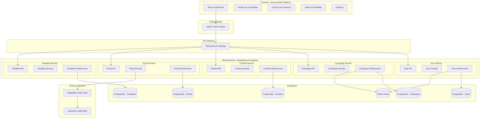
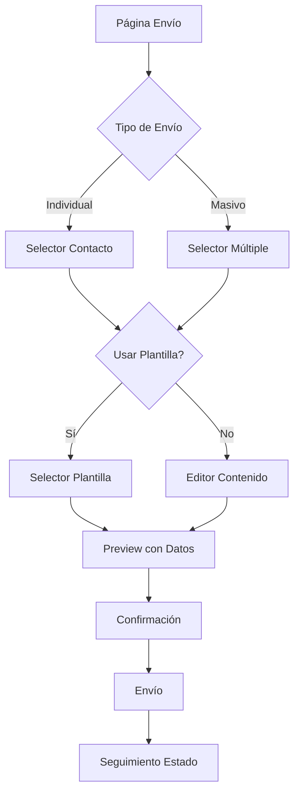

# Sistema de Correos Masivos - Tareas de Implementación

## Arquitectura del Sistema

## Tareas de Implementación

### Fase 1: Configuración Inicial del Proyecto
- [x] **Tarea 1.1**: Configurar estructura de microservicios - **Estado: ✅ COMPLETADO**
  - [x] Crear proyecto Maven multi-módulo para microservicios
  - [x] Configurar Spring Boot parent y dependencias comunes
  - [x] Estructura hexagonal: `api/`, `domain/`, `infrastructure/`
  - [x] Configurar variables de entorno y profiles

- [x] **Tarea 1.2**: Configurar API Gateway y bases de datos - **Estado: ✅ COMPLETADO**
  - [x] **1.2.1**: Configurar Spring Cloud Gateway con routing básico
    - [x] Configurar rutas para todos los microservicios
    - [x] Configurar CORS global
    - [x] Configurar profiles (dev/prod)
    - [x] Configurar logging y actuator endpoints
  - [x] **1.2.2**: Configurar conexiones PostgreSQL para cada microservicio
    - [x] User Service - Base de datos `correos_masivos_users`
    - [x] Contact Service - Base de datos `correos_masivos_contacts`
    - [x] Campaign Service - Base de datos `correos_masivos_campaigns`
    - [x] Email Service - Base de datos `correos_masivos_emails`
    - [x] Template Service - Base de datos `correos_masivos_templates`
  - [x] **1.2.3**: Configurar Redis para cache y sesiones
    - [x] Configuración Redis en API Gateway
    - [x] Configuración Redis en todos los microservicios
  - [x] **1.2.4**: Crear scripts de migración con Flyway
    - [x] User Service - Tabla users, roles, permissions
    - [x] Contact Service - Tabla contacts, contact_lists, segments
    - [x] Campaign Service - Tabla campaigns, campaign_contacts
    - [x] Email Service - Tabla email_logs, email_status
    - [x] Template Service - Tabla templates, template_variables
  - [x] **1.2.5**: Configurar validación de esquemas de base de datos
    - [x] Script de validación de conexiones PostgreSQL
    - [x] Configuración de migraciones Flyway en todos los servicios
    - [x] Variables de entorno actualizadas para todas las bases de datos

### Fase 2: Autenticación y Microservicios Base
- [ ] **Tarea 2.1**: Configurar Auth0 como IdP - **Estado: ⚠️ EN PROGRESO**
  - [ ] **2.1.1**: Configurar tenant Auth0
    - [ ] Crear cuenta y tenant en Auth0
    - [ ] Configurar aplicación SPA (Single Page Application)
    - [ ] Configurar aplicación M2M (Machine to Machine)
    - [ ] Configurar dominios y URLs de callback
  - [ ] **2.1.2**: Configurar roles y permisos en Auth0
    - [ ] Crear roles: ADMIN, MANAGER, USER
    - [ ] Crear permisos (scopes) para cada recurso
    - [ ] Asignar permisos a roles
    - [ ] Configurar reglas de asignación automática
  - [x] **2.1.3**: Integrar Auth0 con API Gateway
    - [x] Agregar dependencias Spring Security OAuth2
    - [x] Configurar JWT validation en Gateway
    - [x] Implementar filtros de autorización
    - [x] Configurar CORS para Auth0
  - [x] **2.1.4**: Configurar JWT validation en microservicios
    - [x] Agregar dependencias OAuth2 Resource Server
    - [x] Configurar validación de tokens JWT
    - [x] Implementar extracción de claims de usuario
    - [x] Configurar seguridad por endpoints
  - [ ] **2.1.5**: Implementar sincronización de usuarios
    - [ ] Webhook para eventos de Auth0
    - [ ] Sincronizar usuarios con User Service
    - [ ] Mapear roles de Auth0 a entidades locales
    - [ ] Manejar creación/actualización automática

- [ ] **Tarea 2.2**: User Service (Arquitectura Hexagonal) - **Estado: ⚠️ PARCIALMENTE IMPLEMENTADO**
  - **Puerto:** 8081 | **Ruta:** `/api/users` | **BD:** `correos_masivos_users`
  - [x] Estructura básica y configuración
  - [x] Esquema de base de datos (users, roles, permissions)
  - [x] Controller básico con health check y login simulado
  - [x] DTOs básicos (LoginRequest, TokenResponse)
  - [ ] Domain layer: Entities y Services completos
  - [ ] Infrastructure layer: Repositories JPA
  - [ ] Sincronización con Auth0/Cognito
  - [ ] CRUD completo de usuarios
  - [ ] Gestión de roles y permisos

- [x] **Tarea 2.3**: Contact Service (Arquitectura Hexagonal) - **Estado: ✅ COMPLETADO**
  - **Puerto:** 8082 | **Ruta:** `/api/contacts` | **BD:** `correos_masivos_contacts`
  - [x] API para carga masiva CSV/Excel
  - [x] Validación con Bean Validation
  - [x] Domain services para segmentación
  - [x] Repository pattern con JPA

- [x] **Tarea 2.4**: Campaign Service (Arquitectura Hexagonal) - **Estado: ✅ COMPLETADO**
  - **Puerto:** 8083 | **Ruta:** `/api/campaigns` | **BD:** `correos_masivos_campaigns`
  - [x] API layer: Controllers y DTOs
  - [x] Domain layer: Entities y Services
  - [x] Infrastructure layer: Repositories JPA
  - [x] Gestión de campañas de correo
  - [x] Programación de envíos
  - [x] Seguimiento de campañas

### Fase 3: Sistema de Colas y Procesamiento
- [x] **Tarea 3.1**: Implementar cola de trabajos - **Estado: ✅ COMPLETADO**
  - [x] Configurar RabbitMQ para colas
  - [x] Crear jobs para envío de correos (EmailJob)
  - [x] Crear jobs para procesamiento de campañas (CampaignJob)
  - [x] Sistema de reintentos y manejo de fallos
  - [x] Configuración de Dead Letter Queues (DLQ)
  - [x] Integración con Campaign Service
  - [x] Listeners para procesamiento asíncrono

- [x] **Tarea 3.2**: Email Service (Arquitectura Hexagonal) - **Estado: ✅ COMPLETADO**
  - **Puerto:** 8084 | **Ruta:** `/api/emails` | **BD:** `correos_masivos_emails`
  - [x] API layer: Controllers y DTOs
  - [x] Domain layer: Entities y Services
  - [x] Infrastructure layer: Repositories JPA
  - [x] Lógica de envío por lotes
  - [x] Control de velocidad (rate limiting)
  - [x] Manejo de bounces y errores SMTP
  - [x] Sistema de logs y tracking de emails
  - [x] Integración con sistema de colas
  - [x] Webhooks para eventos de email
  - [x] Sistema de reintentos automáticos

- [x] **Tarea 3.3**: Template Service (Arquitectura Hexagonal) - **Estado: ✅ COMPLETADO**
  - **Puerto:** 8085 | **Ruta:** `/api/templates` | **BD:** `correos_masivos_templates`
  - [x] API layer: Controllers y DTOs
  - [x] Domain layer: Entities y Services
  - [x] Infrastructure layer: Repositories JPA
  - [x] Sistema de plantillas HTML
  - [x] Personalización con datos de contacto
  - [x] Vista previa de correos
  - [x] Renderizado de plantillas con variables
  - [x] Gestión de estados (draft, active, archived)
  - [x] Validación de plantillas
  - [x] Duplicación de plantillas

### Fase 4: Integración SMTP
- [x] **Tarea 4.1**: Configurar proveedores SMTP con SendGrid - **Estado: ✅ COMPLETADO**
  - [x] **4.1.1**: Configurar SendGrid como proveedor principal
    - [x] Agregar dependencias SendGrid Java SDK
    - [x] Configurar credenciales y API Key
    - [x] Implementar servicio de envío básico
    - [x] Configurar templates y personalización
  - [x] **4.1.2**: Implementar múltiples proveedores SMTP
    - [x] Configurar MailHog para desarrollo local
    - [x] Configurar Gmail SMTP como backup
    - [x] Implementar patrón Strategy para proveedores
    - [x] Configurar prioridades de proveedores
  - [x] **4.1.3**: Implementar sistema de failover
    - [x] Detectar fallos de proveedor principal
    - [x] Cambio automático a proveedor backup
    - [x] Logging de fallos y cambios de proveedor
    - [x] Métricas de éxito/fallo por proveedor
  - [ ] **4.1.4**: Configurar límites y rate limiting
    - [ ] Implementar límites diarios/horarios por proveedor
    - [ ] Control de velocidad de envío
    - [ ] Queue management para grandes volúmenes
    - [ ] Monitoreo de cuotas de API

- [ ] **Tarea 4.2**: Manejo de respuestas - **Estado: No Completado**
  - [ ] Procesamiento de webhooks
  - [ ] Tracking de aperturas y clics
  - [ ] Gestión de unsubscribes

### Fase 5: Frontend - Plataforma Administrativa Next.js
- [x] **Tarea 5.1**: Configurar Next.js Admin Platform - **Estado: ✅ COMPLETADO**
  - [x] **5.1.1**: Configurar proyecto Next.js base
    - [x] Crear proyecto Next.js 15 con App Router
    - [x] Configurar TypeScript con tipos estrictos
    - [x] Configurar ESLint y Prettier
    - [x] Configurar estructura de carpetas (app/, components/, lib/, types/)
  - [x] **5.1.2**: Configurar Auth0 para frontend
    - [x] Instalar @auth0/nextjs-auth0
    - [x] Configurar variables de entorno Auth0
    - [x] Configurar Auth0Provider y middleware
    - [x] Implementar páginas de login/logout/callback
    - [x] Configurar protección de rutas
  - [x] **5.1.3**: Configurar sistema de diseño
    - [x] Instalar y configurar Tailwind CSS
    - [x] Configurar tema personalizado Xtrim (colores, tipografía)
    - [x] Crear componentes base con glass effect
    - [x] Configurar iconos con Heroicons
  - [x] **5.1.4**: Configurar cliente HTTP y API
    - [x] Crear cliente API básico con fetch
    - [x] Configurar servicios API para cada microservicio
    - [x] Configurar manejo de errores global
  - [x] **5.1.5**: Implementar layout y navegación
    - [x] Crear layout principal con sidebar
    - [x] Implementar navegación responsive
    - [x] Implementar tema claro/oscuro
    - [x] Crear header con información de usuario
  - [x] **5.1.6**: Implementar dashboard inicial
    - [x] Crear página de dashboard con métricas básicas
    - [x] Implementar gráficos con Recharts
    - [x] Crear widgets de estadísticas
    - [x] Implementar actividad reciente
    - [x] Configurar estados de carga

- [x] **Tarea 5.2**: Módulo de Gestión de Contactos - **Estado: ✅ COMPLETADO**
  - [x] **5.2.1**: Configurar páginas y rutas de contactos
    - [x] Crear página principal de contactos (/contacts)
    - [x] Crear página de detalle de contacto (/contacts/[id])
    - [x] Crear página de importación (/contacts/import)
    - [x] Crear página de listas de contactos (/contacts/lists)
    - [x] Configurar navegación en sidebar con subitems
  - [x] **5.2.2**: Implementar tabla de contactos con funcionalidades avanzadas
    - [x] Crear componente ContactTable con funcionalidades completas
    - [x] Implementar paginación client-side
    - [x] Implementar ordenamiento por columnas
    - [x] Implementar filtros avanzados (nombre, email, estado, tags)
    - [x] Implementar búsqueda en tiempo real
    - [x] Implementar selección múltiple con acciones en lote
  - [x] **5.2.3**: Implementar formularios de contacto
    - [x] Crear formulario de creación de contacto
    - [x] Crear formulario de edición de contacto
    - [x] Implementar validación básica (email, campos requeridos)
    - [x] Implementar campos personalizados (tags, notas, dirección)
    - [x] Crear modal de confirmación para eliminación
  - [x] **5.2.4**: Implementar sistema de importación masiva
    - [x] Crear componente de drag & drop para archivos CSV
    - [x] Implementar preview de datos antes de importar
    - [x] Implementar mapeo de columnas (CSV headers → campos de contacto)
    - [x] Implementar validación masiva con reporte de errores
    - [x] Implementar simulación de progreso para importaciones
    - [x] Crear sistema de plantillas CSV para descarga
  - [x] **5.2.5**: Implementar gestión de listas de contactos
    - [x] Crear CRUD básico para listas de contactos
    - [x] Implementar vista de listas con métricas
    - [x] Crear sistema de tags/etiquetas
    - [x] Implementar formulario de creación de listas
    - [x] Crear interfaz de gestión de listas
  - [x] **5.2.6**: Implementar componentes de filtrado
    - [x] Crear componente ContactFilters avanzado
    - [x] Implementar filtros por estado, fecha, empresa, tags
    - [x] Crear sistema de filtros activos con badges
    - [x] Implementar limpieza de filtros
  - [x] **5.2.7**: Implementar página de detalle de contacto
    - [x] Crear vista completa de información de contacto
    - [x] Implementar historial de emails enviados
    - [x] Crear sección de tags y notas
    - [x] Implementar indicadores de estado y actividad
  - [x] **5.2.8**: Integrar con API backend
    - [x] Crear métodos API para CRUD de contactos
    - [x] Implementar métodos para listas de contactos
    - [x] Crear método de importación de archivos
    - [x] Configurar manejo de errores

- [x] **Tarea 5.3**: Módulo de Campañas - **Estado: ✅ COMPLETADO**
  - [x] **5.3.1**: Configurar páginas y rutas de campañas
    - [x] Crear página principal de campañas (/campaigns)
    - [x] Crear página de detalle de campaña (/campaigns/[id])
    - [x] Crear página de creación de campaña (/campaigns/new)
    - [x] Crear página de edición de campaña (/campaigns/[id]/edit)
    - [x] Configurar navegación en sidebar con subitems
  - [x] **5.3.2**: Implementar tabla de campañas con funcionalidades avanzadas
    - [x] Crear tabla de campañas con datos mock
    - [x] Implementar filtros por estado (draft, scheduled, sent, paused)
    - [x] Implementar búsqueda por nombre y asunto
    - [x] Implementar acciones por estado (pausar, reanudar, cancelar)
    - [x] Mostrar métricas de rendimiento por campaña
  - [x] **5.3.3**: Implementar wizard de creación de campañas
    - [x] Paso 1: Información básica (nombre, asunto, remitente)
    - [x] Paso 2: Selección de destinatarios (listas de contactos)
    - [x] Paso 3: Diseño del email (selector de plantillas)
    - [x] Paso 4: Programación (envío inmediato vs programado)
    - [x] Paso 5: Revisión y confirmación final
    - [x] Navegación entre pasos con indicadores de progreso
  - [x] **5.3.4**: Implementar gestión de estados de campaña
    - [x] Estados: draft, scheduled, sending, sent, paused
    - [x] Transiciones de estado dinámicas
    - [x] Acciones por estado (editar, pausar, reanudar, cancelar)
    - [x] Badges visuales de estado con colores
    - [x] Actualización de estado en tiempo real
  - [x] **5.3.5**: Implementar programación de envíos
    - [x] Selector de fecha y hora para envío programado
    - [x] Toggle entre envío inmediato y programado
    - [x] Validación básica de fechas futuras
    - [x] Interfaz de programación en wizard
  - [x] **5.3.6**: Implementar preview de correos
    - [x] Componente CampaignPreview con vista desktop/mobile
    - [x] Preview responsive con toggle de dispositivo
    - [x] Simulación de contenido de email
    - [x] Header de email con remitente y asunto
  - [x] **5.3.7**: Implementar métricas y analytics de campañas
    - [x] Dashboard de métricas en página principal
    - [x] Estadísticas detalladas: enviados, entregados, abiertos, clics
    - [x] Gráficos de barras y pie charts con Recharts
    - [x] Cálculo de tasas de rendimiento (apertura, clic, rebote)
    - [x] Vista detallada de métricas por campaña
  - [x] **5.3.8**: Implementar selección de plantillas
    - [x] Selector de plantillas en wizard paso 3
    - [x] Grid de plantillas con preview
    - [x] Selección visual de plantillas
    - [x] Integración con templateId en datos de campaña
  - [x] **5.3.9**: Implementar funcionalidades adicionales
    - [x] Botones de acción en tabla (ver, editar, eliminar)
    - [x] Confirmación de eliminación de campañas
    - [x] Navegación entre páginas del módulo
    - [x] Integración con API client para operaciones CRUD

- [x] **Tarea 5.4**: Editor de Plantillas y Dashboard Avanzado - **Estado: ✅ COMPLETADO**
  - [x] **5.4.1**: Configurar páginas y rutas de plantillas
    - [x] Crear página principal de plantillas (/templates)
    - [x] Crear página de detalle de plantilla (/templates/[id])
    - [x] Crear página de creación de plantilla (/templates/new)
    - [x] Crear página de edición de plantilla (/templates/[id]/edit)
    - [x] Configurar navegación en sidebar con subitems
  - [x] **5.4.2**: Implementar editor HTML avanzado
    - [x] Crear editor de código HTML con textarea
    - [x] Implementar inserción de variables dinámicas
    - [x] Crear preview en tiempo real responsive
    - [x] Implementar toggle entre editor y preview
    - [x] Configurar plantilla base HTML predefinida
  - [x] **5.4.3**: Implementar sistema de variables dinámicas
    - [x] Crear selector de variables de contacto
    - [x] Implementar sistema de variables personalizadas
    - [x] Crear inserción automática en editor
    - [x] Implementar validación de variables
    - [x] Crear preview con datos de muestra
  - [x] **5.4.4**: Implementar gestión de plantillas
    - [x] Crear grid de plantillas con filtros avanzados
    - [x] Implementar estados de plantilla (draft, active, archived)
    - [x] Crear sistema de duplicación de plantillas
    - [x] Implementar eliminación con confirmación
    - [x] Crear galería de plantillas con preview
  - [x] **5.4.5**: Implementar dashboard avanzado con métricas en tiempo real
    - [x] Mejorar widgets de métricas principales
    - [x] Mantener gráficos interactivos con Recharts
    - [x] Configurar actualización automática cada 30 segundos
    - [x] Implementar timestamp de última actualización
    - [x] Agregar variación aleatoria en métricas para simular tiempo real
  - [x] **5.4.6**: Implementar vista de detalle de plantillas
    - [x] Crear página de detalle completa
    - [x] Implementar preview responsive (desktop/mobile)
    - [x] Mostrar información de plantilla y variables
    - [x] Crear toggle entre preview y código fuente
    - [x] Implementar acciones (editar, duplicar, eliminar)
  - [x] **5.4.7**: Implementar funcionalidades adicionales del editor
    - [x] Crear modo responsive para preview
    - [x] Implementar contador de caracteres
    - [x] Crear información de plantilla en sidebar
    - [x] Implementar gestión de estado de plantilla
    - [x] Crear sistema de variables con inserción rápida
  - [x] **5.4.8**: Integrar con API backend
    - [x] Crear métodos API para CRUD de plantillas
    - [x] Implementar métodos de duplicación y preview
    - [x] Configurar manejo de errores
    - [x] Preparar estructura para integración backend

- [x] **Tarea 5.5**: Módulo de Visualización de Estado de Correos - **Estado: ✅ COMPLETADO**
  - [x] **5.5.1**: Configurar páginas y rutas de estado de correos
    - [x] Crear página principal de estado de correos (/emails/status)
    - [x] Crear página de logs de envío (/emails/logs)
    - [x] Crear página de métricas de entrega (/emails/metrics)
    - [x] Configurar navegación en sidebar con subitems
  - [x] **5.5.2**: Implementar dashboard de estado de correos en tiempo real
    - [x] Crear widgets de métricas principales (enviados, entregados, abiertos, clics)
    - [x] Implementar gráficos de estado con Recharts (barras y pie)
    - [x] Crear indicadores de estado: pending, sent, delivered, opened, clicked, bounced, failed
    - [x] Implementar actualización automática cada 30 segundos
    - [x] Crear filtros por estado y búsqueda por email/asunto
    - [x] Implementar contador en tiempo real de correos por estado
  - [x] **5.5.3**: Implementar tabla de correos con estados detallados
    - [x] Crear tabla con columnas: destinatario, asunto, estado, campaña, proveedor, fecha
    - [x] Implementar badges de estado con colores e iconos:
      - Pending (amarillo), Sent (azul), Delivered (verde)
      - Opened (verde claro), Clicked (verde oscuro)
      - Bounced (naranja), Failed (rojo)
    - [x] Implementar filtros por estado y búsqueda por email
    - [x] Mostrar detalles adicionales (timestamps, errores, razones de rebote)
    - [x] Implementar datos mock con 6 emails de ejemplo
  - [x] **5.5.4**: Implementar sistema de logs de envío
    - [x] Crear página de logs con diferentes niveles (info, success, warning, error)
    - [x] Implementar filtros por nivel y fecha
    - [x] Mostrar detalles de cada log con timestamps
    - [x] Crear actualización automática cada 10 segundos
    - [x] Implementar iconos y colores por nivel de log
  - [x] **5.5.5**: Implementar métricas avanzadas de entrega
    - [x] Crear dashboard de métricas con tendencias
    - [x] Implementar gráficos de líneas y áreas para tendencias diarias
    - [x] Mostrar distribución por hora del día
    - [x] Crear análisis de rendimiento por proveedor SMTP
    - [x] Implementar indicadores de tendencia (up/down)
  - [x] **5.5.6**: Implementar actualización en tiempo real
    - [x] Configurar actualización automática cada 30 segundos en estado
    - [x] Implementar actualización cada 10 segundos en logs
    - [x] Mostrar timestamp de última actualización
    - [x] Crear datos dinámicos simulados
  - [x] **5.5.7**: Implementar analytics y reportes de entrega
    - [x] Crear gráficos de tendencias diarias con áreas apiladas
    - [x] Implementar análisis de distribución por hora del día
    - [x] Crear métricas de rendimiento por proveedor SMTP
    - [x] Implementar indicadores de tendencia con porcentajes
    - [x] Mostrar tasas de entrega, apertura y clic
    - [x] Crear filtros por rango de fecha
  - [x] **5.5.8**: Implementar filtros y búsqueda avanzada
    - [x] Crear filtros por estado de email
    - [x] Implementar búsqueda por email destinatario y asunto
    - [x] Crear filtros por nivel de log
    - [x] Implementar filtro por fecha en logs
    - [x] Crear filtros por rango de fecha en métricas
  - [x] **5.5.9**: Implementar visualización de correos fallidos
    - [x] Mostrar correos con estado 'failed' y 'bounced'
    - [x] Mostrar razón detallada del fallo en tabla
    - [x] Implementar badges de error con colores distintivos
    - [x] Crear logs de errores con detalles técnicos
    - [x] Mostrar mensajes de error específicos
  - [x] **5.5.10**: Preparar integración con API backend
    - [x] Crear métodos API para estado de emails
    - [x] Implementar métodos para logs y métricas
    - [x] Crear método de reintento de emails fallidos
    - [x] Configurar estructura para webhooks
    - [x] Preparar datos mock realistas

- [x] **Tarea 5.6**: Módulo de Envío de Correos Frontend - **Estado: ✅ COMPLETADO**
  - [x] **5.6.1**: Configurar páginas y rutas de envío
    - [x] Crear página principal de envío (/emails/send)
    - [x] Crear página de envío individual (/emails/send/single)
    - [x] Crear página de envío masivo (/emails/send/bulk)
    - [x] Crear página de historial de envíos (/emails/history)
    - [x] Configurar navegación en sidebar
  - [x] **5.6.2**: Implementar formulario de envío individual
    - [x] Crear selector de contacto con búsqueda y autocompletado
    - [x] Implementar toggle "Usar plantilla" / "Correo normal"
    - [x] Crear selector de plantilla con preview
    - [x] Implementar editor de asunto (editable si usa plantilla)
    - [x] Crear editor de contenido HTML/texto básico
    - [x] Implementar preview del correo con datos del contacto
    - [x] Crear botón "Enviar" con validación
    - [x] Implementar validación básica de campos requeridos
  - [x] **5.6.3**: Implementar formulario de envío masivo
    - [x] Crear selector múltiple de contactos con filtros
    - [x] Implementar opciones: "Seleccionar contactos", "Por lista", "Por segmento"
    - [x] Crear contador dinámico de destinatarios seleccionados
    - [x] Implementar toggle "Usar plantilla" / "Correo normal"
    - [x] Crear selector de plantilla con preview
    - [x] Implementar editor de asunto único para todos
    - [x] Crear editor de contenido único básico
    - [x] Implementar preview con datos de muestra
    - [x] Crear modal de confirmación con resumen de envío
    - [x] Implementar advertencias para envíos >100 destinatarios
  - [x] **5.6.4**: Implementar selector de contactos avanzado
    - [x] Crear componente ContactSelector funcional
    - [x] Implementar búsqueda en tiempo real por nombre/email
    - [x] Crear selección individual con checkboxes
    - [x] Implementar vista de contactos seleccionados
    - [x] Crear selección por listas de contactos
    - [x] Implementar datos mock para pruebas
  - [x] **5.6.5**: Implementar selector de plantillas
    - [x] Crear componente TemplateSelector funcional
    - [x] Implementar selección de plantillas con datos mock
    - [x] Mostrar información básica de plantillas
    - [x] Crear opción "Sin plantilla" para correo normal
    - [x] Implementar aplicación automática de plantilla
  - [x] **5.6.6**: Implementar editor de contenido de correo
    - [x] Crear editor de texto básico con textarea
    - [x] Implementar inserción de variables de contacto
    - [x] Crear soporte para contenido HTML básico
    - [x] Implementar validación de contenido requerido
  - [x] **5.6.7**: Implementar sistema de preview de correos
    - [x] Crear componente EmailPreview funcional
    - [x] Implementar renderizado con datos de contacto
    - [x] Mostrar preview de asunto con personalización
    - [x] Crear toggle para mostrar/ocultar preview
    - [x] Implementar reemplazo de variables dinámicas
  - [x] **5.6.8**: Implementar proceso de envío y confirmación
    - [x] Crear modal de confirmación para envíos masivos
    - [x] Mostrar resumen detallado antes del envío
    - [x] Implementar validaciones finales antes de envío
    - [x] Crear simulación de envío exitoso
    - [x] Implementar advertencias de seguridad
  - [x] **5.6.9**: Implementar historial y seguimiento de envíos
    - [x] Crear tabla de envíos con filtros por fecha, tipo, estado
    - [x] Implementar vista de detalle de envío individual
    - [x] Mostrar métricas de envío: entregados, abiertos, clics, fallidos
    - [x] Crear estadísticas rápidas del historial
    - [x] Implementar acciones de reintento y cancelación
    - [x] Crear modal de detalles con información completa
  - [x] **5.6.10**: Implementar validaciones y controles de seguridad
    - [x] Validar campos requeridos antes del envío
    - [x] Crear advertencias para envíos masivos grandes
    - [x] Implementar confirmación doble para >100 destinatarios
    - [x] Crear validación de selección de destinatarios
    - [x] Implementar estados de envío con badges visuales
  - [x] **5.6.11**: Preparar integración con APIs backend
    - [x] Crear estructura para servicios API de envío
    - [x] Implementar datos mock realistas para pruebas
    - [x] Preparar métodos para envío individual y masivo
    - [x] Crear estructura para manejo de estados de envío
    - [x] Implementar simulación de respuestas de API

### Fase 6: Características Avanzadas
- [ ] **Tarea 6.1**: Sistema de reportes - **Estado: No Completado**
  - [ ] Estadísticas de entrega
  - [ ] Análisis de engagement
  - [ ] Exportación de reportes

- [ ] **Tarea 6.2**: Segmentación avanzada - **Estado: No Completado**
  - [ ] Filtros dinámicos
  - [ ] Grupos de contactos
  - [ ] Personalización por segmento

- [ ] **Tarea 6.3**: Automatización - **Estado: No Completado**
  - [ ] Campañas programadas
  - [ ] Secuencias de correos
  - [ ] Triggers basados en eventos

### Fase 7: Testing y Optimización
- [ ] **Tarea 7.1**: Testing unitario e integración - **Estado: No Completado**
  - [ ] Tests para API endpoints con JUnit 5
  - [ ] Tests para componentes frontend con Playwright
  - [ ] Tests de carga para envíos masivos

- [ ] **Tarea 7.2**: Optimización de rendimiento - **Estado: No Completado**
  - [ ] Caching de plantillas con Redis
  - [ ] Optimización de consultas DB
  - [ ] Compresión de respuestas

- [ ] **Tarea 7.3**: Monitoreo y logging - **Estado: No Completado**
  - [ ] Métricas con Prometheus + Grafana
  - [ ] Alertas de errores
  - [ ] Dashboard de salud del sistema

### Fase 8: Despliegue y Producción
- [ ] **Tarea 8.1**: Configuración de producción - **Estado: No Completado**
  - [ ] Docker containers para microservicios
  - [ ] Variables de entorno de producción
  - [ ] Configuración de SSL

- [ ] **Tarea 8.2**: CI/CD Pipeline - **Estado: No Completado**
  - [ ] GitHub Actions para automatización
  - [ ] Tests automáticos en pipeline
  - [ ] Rollback automático

- [ ] **Tarea 8.3**: Backup y recuperación - **Estado: No Completado**
  - [ ] Backup automático de PostgreSQL
  - [ ] Estrategia de recuperación
  - [ ] Documentación de procedimientos

## 🏢 **Resumen de Microservicios**

| Microservicio | Puerto | Ruta API Gateway | Base de Datos | Estado |
|---------------|--------|------------------|---------------|--------|
| API Gateway | 8080 | `/` | - | ✅ COMPLETADO |
| User Service | 8081 | `/api/users` | `correos_masivos_users` | ⚠️ PARCIAL |
| Contact Service | 8082 | `/api/contacts` | `correos_masivos_contacts` | ✅ COMPLETADO |
| Campaign Service | 8083 | `/api/campaigns` | `correos_masivos_campaigns` | ✅ COMPLETADO |
| Email Service | 8084 | `/api/emails` | `correos_masivos_emails` | ✅ COMPLETADO |
| Template Service | 8085 | `/api/templates` | `correos_masivos_templates` | ✅ COMPLETADO |

**Progreso:** 5/6 microservicios completados (83%)

## 📧 **Flujo de Envío de Correos Frontend**

## 📊 **Estado de Correos - Definiciones**

| Estado | Descripción | Color Badge |
|--------|-------------|-------------|
| **Pending** | Correo en cola, pendiente de envío | 🟡 Amarillo |
| **Sent** | Correo enviado al proveedor SMTP | 🔵 Azul |
| **Delivered** | Correo entregado al servidor destinatario | 🟢 Verde |
| **Opened** | Destinatario abrió el correo | 🟢 Verde claro |
| **Clicked** | Destinatario hizo clic en algún enlace | 🟢 Verde oscuro |
| **Bounced** | Correo rebotado (temporal o permanente) | 🟠 Naranja |
| **Failed** | Error en el envío | 🔴 Rojo |
| **Spam** | Marcado como spam por el destinatario | ⚫ Gris |
| **Unsubscribed** | Destinatario se dio de baja | 🟣 Morado |

## Tecnologías Recomendadas

### Backend - Microservicios
- **Framework**: Java 17 + Spring Boot 3.x
- **Arquitectura**: Hexagonal (Ports & Adapters)
- **API Gateway**: Spring Cloud Gateway
- **Message Queue**: RabbitMQ / AWS SQS
- **Databases**: PostgreSQL + Redis
- **Authentication**: Auth0 / AWS Cognito

### Frontend - Plataforma Administrativa
- **Framework**: Next.js 14 + TypeScript
- **Styling**: Tailwind CSS + shadcn/ui
- **State Management**: Zustand
- **Forms**: React Hook Form + Zod
- **Charts**: Chart.js / Recharts
- **Editor**: TinyMCE

### DevOps
- **Containers**: Docker + Kubernetes
- **CI/CD**: GitHub Actions
- **Monitoring**: Prometheus + Grafana
- **Testing**: JUnit 5 + Testcontainers + Playwright

## Estimación de Tiempo

- **Fase 1-2**: 2-3 semanas
- **Fase 3-4**: 3-4 semanas  
- **Fase 5**: 3-4 semanas
- **Fase 6-7**: 2-3 semanas
- **Fase 8**: 1-2 semanas

**Total estimado**: 11-16 semanas para un desarrollador full-stack experimentado.

## Notas Importantes

1. Comenzar con un MVP que incluya las funcionalidades básicas (Fases 1-4)
2. Implementar logging detallado desde el inicio
3. Considerar límites de proveedores SMTP para evitar bloqueos
4. Implementar validación exhaustiva de datos de entrada
5. Planificar escalabilidad desde el diseño inicial